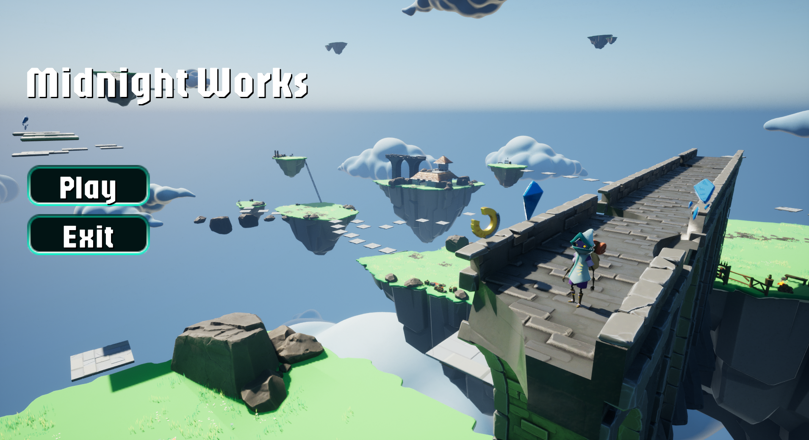
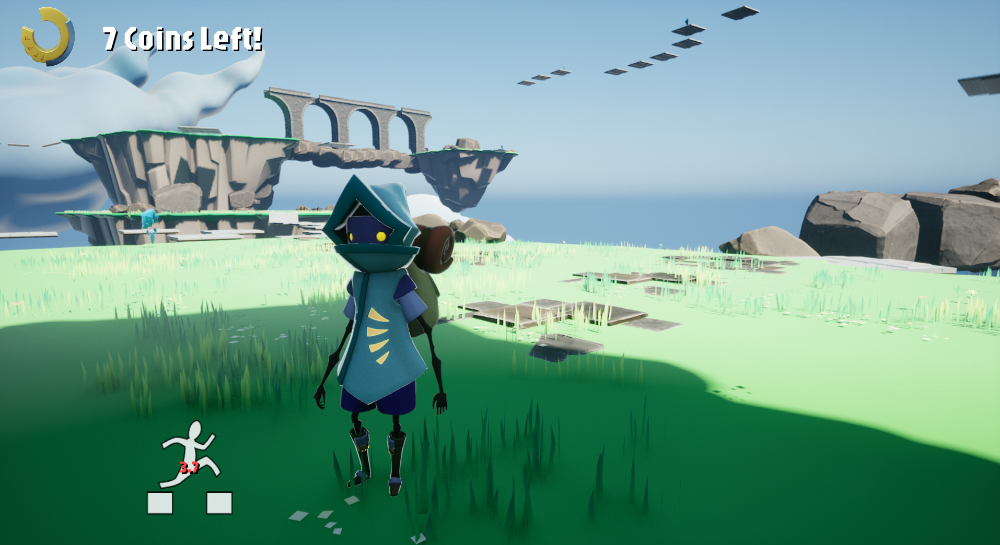
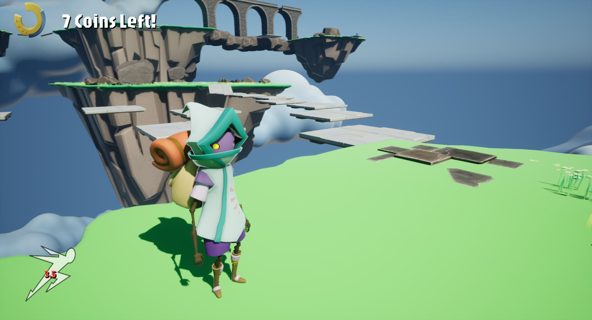

Game was writter fully in C++ (where it was possible). 
Made all main and bonus tasks.

To complete the game you have to find all coins and then proceed to the castle.

Also added some cool features which can be viewed during gameplay. E.g. booster(speed, jump).
Made cool animations when picking up boosters.
Made cool transitions between levels. Transition when falling out of map and other cool stuff.

